# Intro to Google Apps Script

Video Guide: [Learn Google Apps Script Project Lesson Create PDF from Docs Using Google Sheet Data send Emails](https://www.youtube.com/watch?v=ikf-oJsStd4)

## What is Google Apps Script?

Google Apps Script is a cloud-based scripting language for extending the functionality of Google Apps and building lightweight cloud-based applications.

It means you write small programs with Apps Script to extend the standard features of Google Workspace Apps. It’s great for filling in the gaps in your workflows.

With Apps Script, you can do cool stuff like automating repeatable tasks, creating documents, emailing people automatically and connecting your Google Sheets to other services you use.

## Goal explaniation

what we will do is automate a creating PDF file using a Doc template by obtaing the information in a Google Form.
then we send the PDF as email and save it to google drive.

## Setup files and folders
Before making the code, let's go into Google drive and create files that will be needed later .
Log into your Google Account - Go to your Google Drive
Select the New button, and create a Folder and then creat a Google form and a Google Doc"or upload a template".
Give them names.

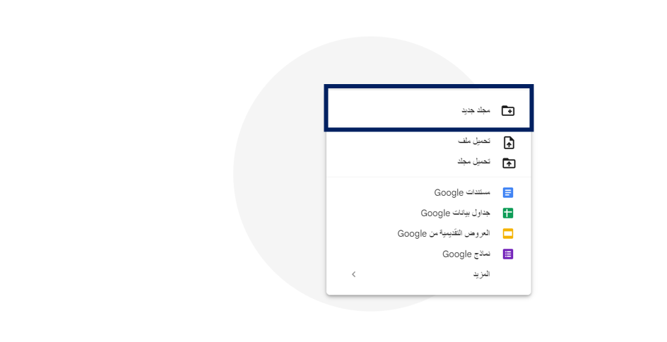

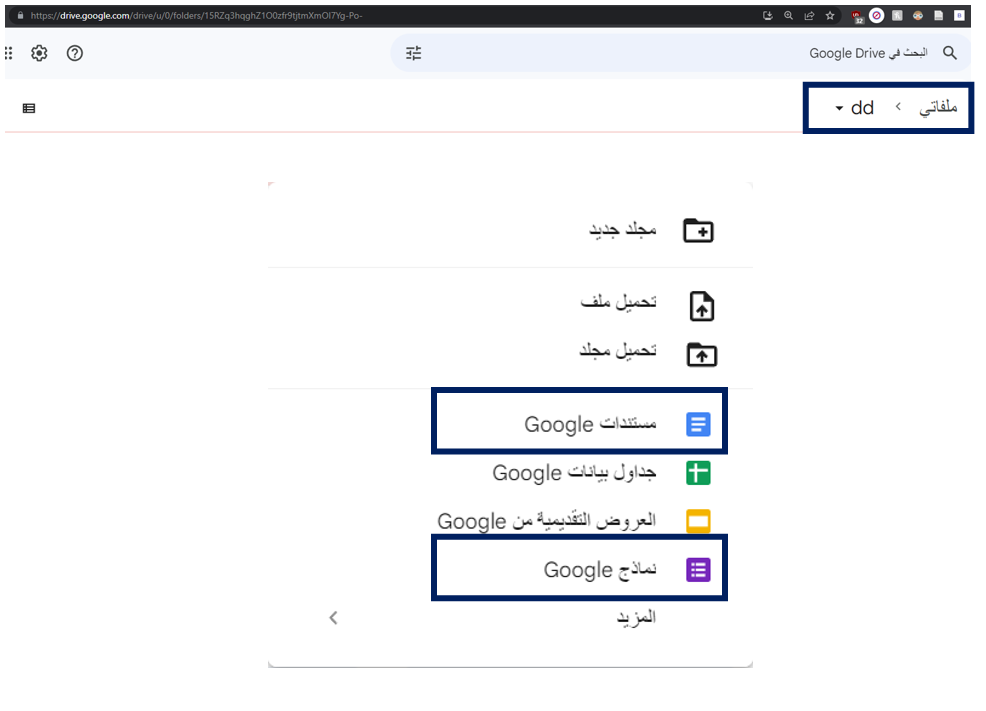

## Google Froms
After create the google form file , click on it and fill the form with you wanted questions that will be display on the PDF file.

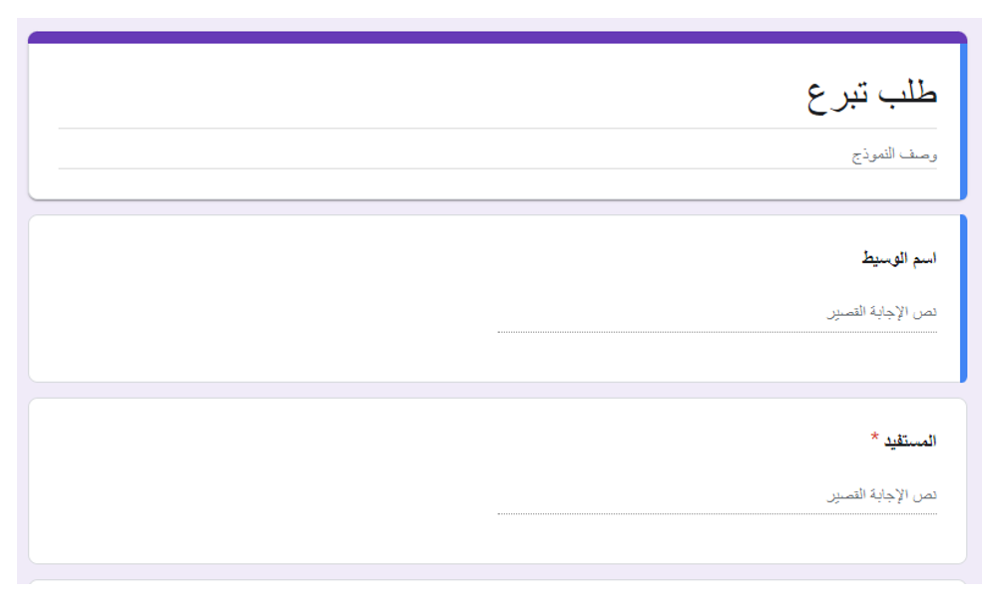

After completing the form, we need to create a sheet and link it to the form, provided that everything that is filled out in the form is sent to the spreadsheet . To do that, go to the responses - Link to Google Spreadsheet.

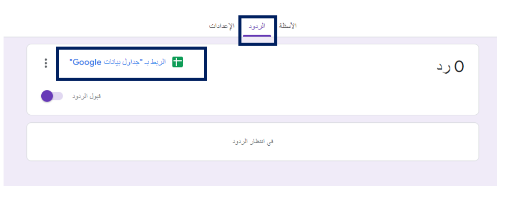
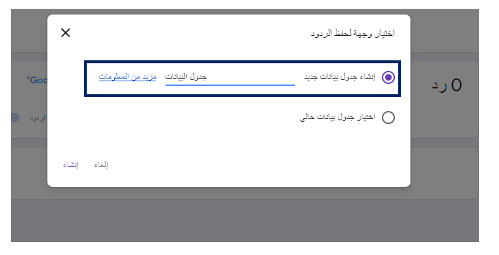
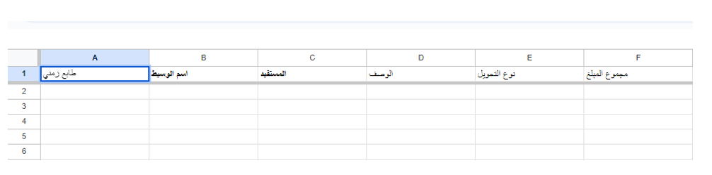

### Google Doc

The template is going to be used as a base for forming the PDF documents.
The template can also have values that will be automatically populated using
Google Apps Script " we will do that later". I’m using the sheet heading values, as uppercase
values and nested within curly brackets. This provides a way to uniquely
identify the values to be replaced. Hello, {طابع زمني} {اسم الوسيط}

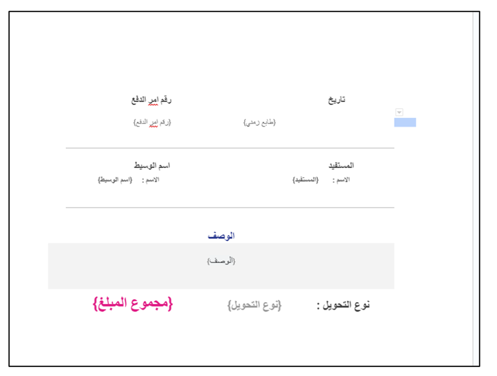

Add Data to the spreadsheet with column headings to match the fields to be
updated in the template.

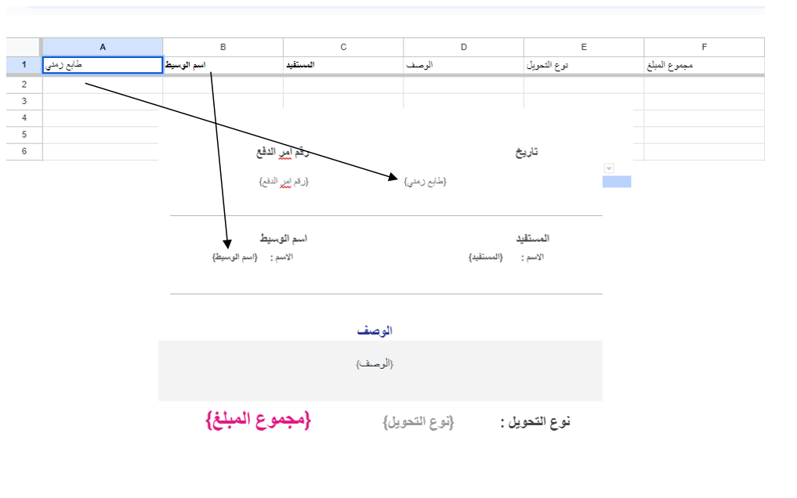

### Google Sheet

Please note that we did not make the Google Sheet file, but we have used the sheet that the responses come with the form already, doing that will link between the form and the sheet, unlike if a file was made in the Diarif or the Excel file was uploaded.
To form and the Excel file , in order to do that go to :
form - responses - click on "show on google sheet"

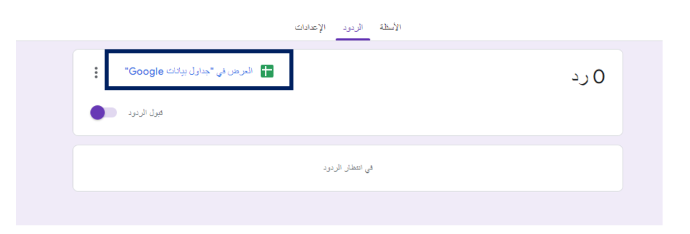

After that make sure the timezone is displayed and correct to you location.

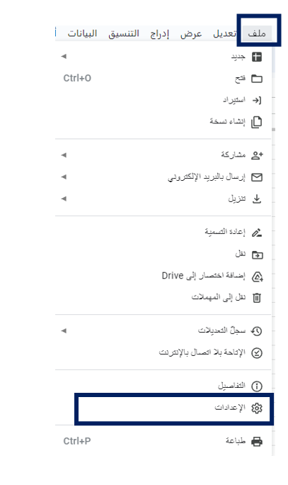

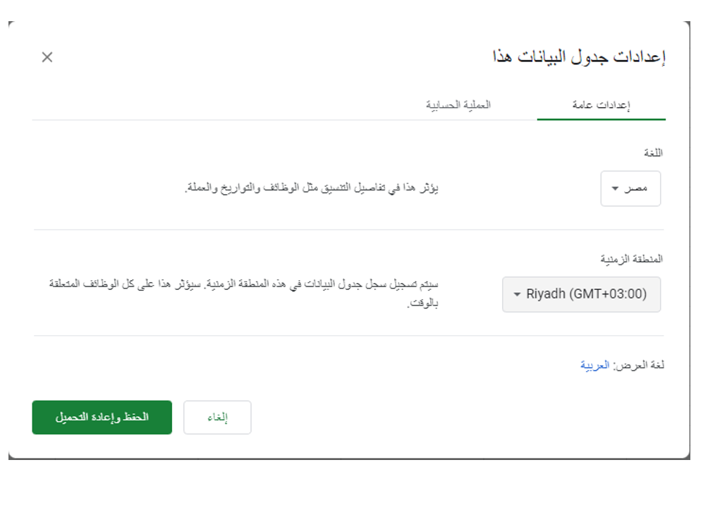

###  App Scripts

Google Script is used to make an automatic PDF file every time a response is received , it will send an email and the PDF is attached to the attachments.
Also, the PDF will be uploaded to the Google Drive folder, which was previously created.
To go to App Scripts, go to the additions in Google Sheet, and to program - Google applications

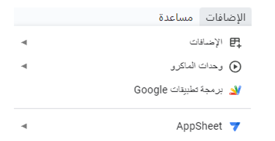

we will use the code below:

>       const SHEETID ='1WOYzqgPXuwHm3BtyPaSlSBmBr-wJwAOMB50Bowz-FeQ';
>       const DOCID ='1NG0KrkutXTTl9WataTub6gbxLtPBSuPrgwdURuXgB4E';
>       const FOLDERID ='1DkSCBz3Ig3rlL-4cauytzMKLSQeEM1-x';
>       
>       function sender() {
>       const sheet = SpreadsheetApp.openById(SHEETID).getSheetByName('data');
>       const temp = DriveApp.getFileById(DOCID);
>       const folder = DriveApp.getFolderById(FOLDERID);
>       const data = sheet.getDataRange().getValues();
>       const rows = data.slice(1);
>       rows.forEach((row,index)=>       {
>         if(row[6] ==``){
>         const file = temp.makeCopy(folder);
>         const doc = DocumentApp.openById(file.getId());
>         const body = doc.getBody();
>         data[0].forEach((heading,i)=>       {
>           const header1 = heading.toUpperCase();
>           body.replaceText(`{${header1}}`,row[i]);
>       })
>       doc.setName(row[0]+row[1]);
>       const blob = doc.getAs(MimeType.PDF);
>       doc.saveAndClose();
>       const pdf = folder.createFile(blob).setName(row[1]+ '.pdf');
>       file.setTrashed(true);
>       const email = "hamdan56431@gmail.com";
>       const subject = row[0]+row[1]+'new file created';
>       const messageBody = `Hi, ${row[0]} Welcome we've created a PDF for you!`;
>       MailApp.sendEmail({
>       to:email,
>       subject:subject,
>       htmlBody: messageBody,
>       attachments: [blob.getAs(MimeType.PDF)]
>       });
>        const tempo = sheet.getRange(index + 2, 17, 1, 1);
>        tempo.setValue((row[0] + new Date()));
>       
>       Logger.log(row);
>       }
>       })
>       }

## Code

In the report view, the essential tools are along the right side: Filters, Visualizations, and Fields. Visualizations are the different ways to display data, and the Fields lists out all the tables, columns, and measures. We have yet to get to measures, so don't worry if you don't know what that is.

1. Linking the Files to the code.
2. Connect the code in the table page in Google Sheet.
  - 2.5 Explaing to How the files are named and how the Google script reads it.
3. Make a pdf file.
4. Send an email that includes the PDF.
5. Put a word yes to make sure that e-mail has been send.

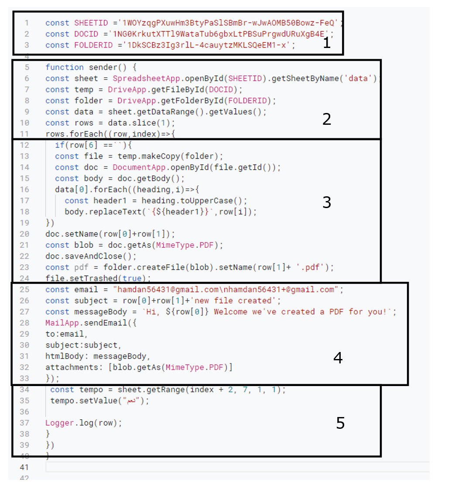

## 1. Linking the Files to the code.

In order to link the sheet, Google doc, and Google Drive folder to the code, copy each of their links. Replace the values below with links you own.

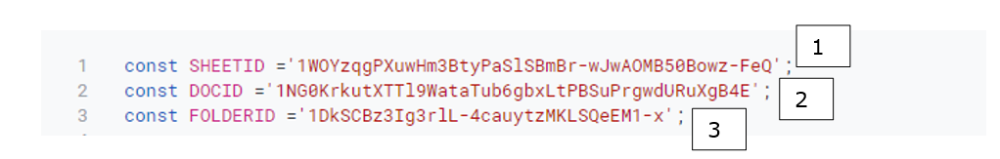

- Google Drive
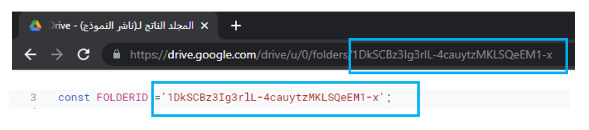

- Google Sheet
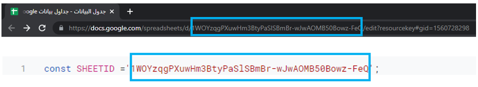

- Google Doc
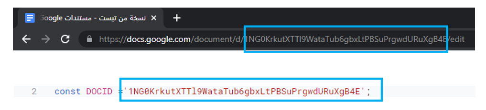

## 2. Connect the code in the table page in Google Sheet.

In the code below, it will take the data in the table.
The only variable to consider is the Sheet name.
You have to make sure that the name in the code is the same as the name of the sheet in Google Sheet.

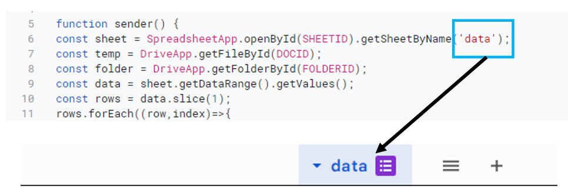

## 2.5 Explaing to How the files are named and how the Google script reads it.

In the code, the Function row[] will be used alot, but what is it?
The script reads the data in the form of a table. Each Row in the Google Sheet table is condider a stand alone Table.

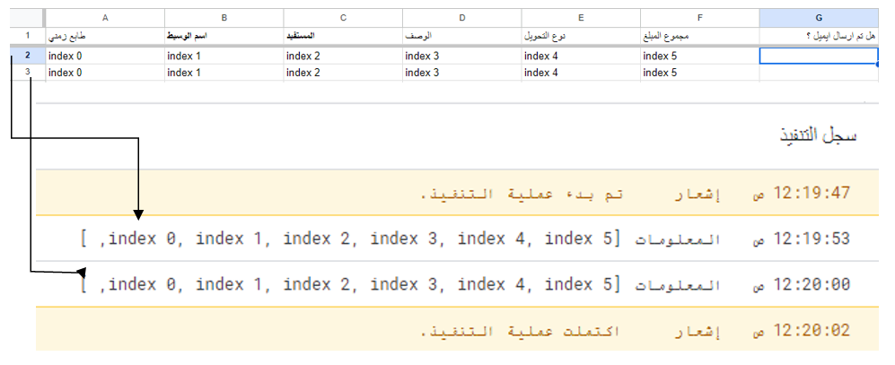

Let's say that we will select the third column below in naming the files.
It will be in writing in the code as " row[2]  ", note that we refer to the first column by the number 0 and so on.
When we say " row[6] " we are referring to the data in column 7.

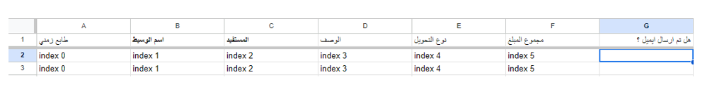

Using this method, we can put a conditional clause in the event that there is empty data in the seventh column to verify that an email has been sent.
if there is data, the could will skipped and moved to the next line of data.
if the cell is empty, a PDF will be created and will send an email attached with the PDF,  next will put the word “Yes” in the cell.    

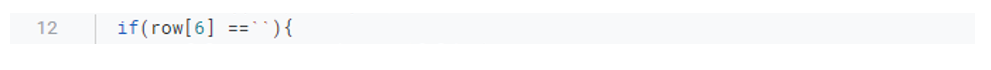

## 3. Make a pdf file.

a word file and a pdf file will be created, provided that the word file  will be deleted if the pdf file is created.
In the code below, you can change the file name, and also if you want to keep the word file.
If you want to change the file name, go to setName() and put the name in brackets
notice that the data in the table was used for the naming the pdf file.

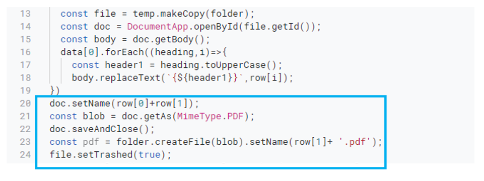

 - word file naming
 change the following to what you want the file name be :
 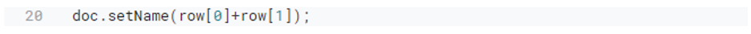

 - PDF file naming
 change the following to what you want the file name be :
 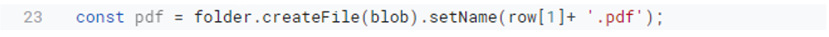

 - Delete the word file after the pdf been created
 if you want to keep the word file delete this line.
 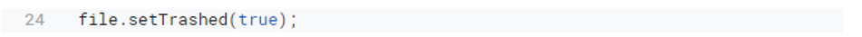

## 4. Send an email that includes the PDF.

The paragraph of sending the e-mail consists of 3 main points:
- The email address
- Subject
- Message

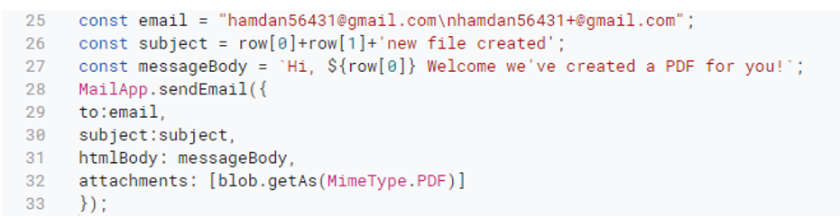   

The email address: and you can put more than one email by adding \n, which means the Enter , and then writing the other email in the paragraph below
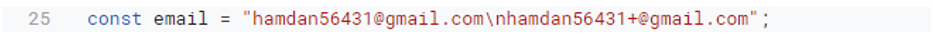   

Subject : You can set variable values via row[] method and also more than one variable value. The image below is an example of setting more than one
Variable and also fixed text.
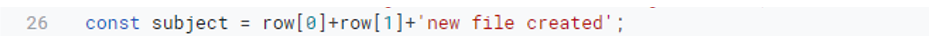   

Message : As mentioned in the previous paragraph, you can write whatever you want, in case you want to put a variable in the middle of a fixed text
Use the ${} sign where you want to add the variable text.
The image below is an example of the method
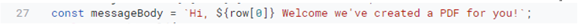   

There is no need to change The rest of the code. 

## 5. Put a word yes to make sure that e-mail has been send.

In Step 2 "Connect the code in the table page in Google Sheet", a conditional was placed to ensure that the e-mail was sent in a specific cell in the table. Column 7 was placed to ensure that if it was empty, the e-mail would be sent, and if there was data on it, it would skip it.
In the code below, we will specfie what coulm should the data be in         :

Change the value in the cell above to the column number that was previously placed in Paragraph 2.
Remember that there was used row[6] that refers to the seventh column.

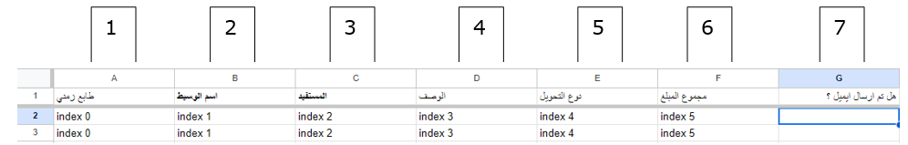

Change the value in the box below to the word you'd like to be in the column.
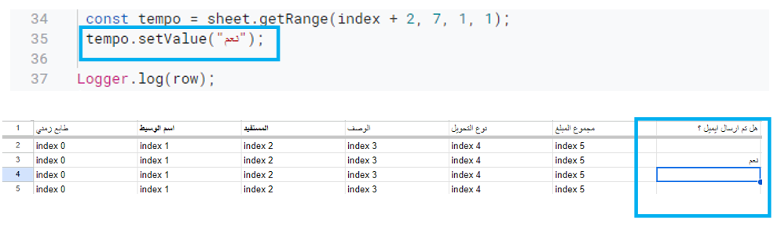

## Wrapping Up

There is much more to explore about Google Apps Script, but you should have a good understanding about hows it works.

Here are some ideas and References that i used:

- Laurence Svekis website: [basescripts](https://basescripts.com/category/apps-script)

